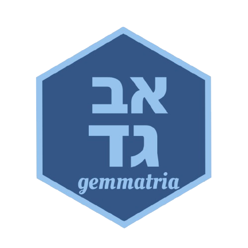

# gemmatria <a href='https://github.com/benyamindsmith/gemmatria/tree/master/'></a>

An R package used for calculating the Gemmatria of Hebrew words and phrases.

## In Memoraim

This package is dedicated in memory of [Avner Milevsky z"l](https://www.linkedin.com/in/avnermil/) whose appreciation and understanding of Gemmatrias far extended my own. For a much more powerful Gemmatria engine check out [http://secretorah.com/](http://secretorah.com) and the Gemmatria sheets that Avner z"l produced with them (available on his LinkedIn profile).  

## What is Gemmatria?

(_From [Wikipedia]([https://en.wikipedia.org/wiki/Gematria)_)

Gematria /ɡəˈmeɪtriə/ (Hebrew: גמטריא or גימטריה, plural גמטראות or גמטריאות, gematriot) is an alphanumeric code of assigning a numerical value to a name, word or phrase based on its letters. People who practice gematria believe that words with identical numerical values may bear some relation to each other or to the number itself. A single word can yield multiple values depending on the cipher used.

## Description

This package contains functions used for calculating the Gemmatria of Hebrew words and phrases. To the best of the author's knoweldge, no other tools in like this are availible in R (while they do exist in other languages).

This is an attempt to provide tools for those interested in studying Hebrew text(s) and would quickly like to see Gemmatrias or rearrangement of the text(s) which they wish to examine. This is also an attempt to contribute to tools which can be used for NLP of Hebrew Language.

The tools presently availible in this package are:

* A standard Gemmatria calculator (`get_gemmatria()`)
* A AtBash Calculator (`get_gemmatria_ab()`)
* A Roshei Taivos Calculator (`get_gemmatria_rt()`)
* A Sofei Taivos Calculator (`get_gemmatria_st()`)
* A Gemmatria Converter (`as_gemmatria()`)
* An AtBash Converter (`as_atbash()`)

## Dependencies

Presently, the only dependency this package has is the `revalue()` function from the `plyr` package. 

## Encoding

Because this deals with Hebrew text, functions are encoded in UTF-8, however for publishing this code on CRAN this imposes some limitations. After running `devtools::check()` on the package. The following warning was produced.

```r
❯ checking R files for non-ASCII characters ... WARNING
  Found the following files with non-ASCII characters:
    as_atbash.R
    as_gemmatria.R
    get_gemmatria.R
    get_gemmatria_atbash.R
    get_gemmatria_rt.R
    get_gemmatria_st.R
  Portable packages must use only ASCII characters in their R code,
  except perhaps in comments.
  Use \uxxxx escapes for other characters.
```

## Installing this Package

This package can be installed with using the `devtools` package

```r
devtools::install_github("benyamindsmith\gemmatria")
```

## Examples

### Getting the Gemmatria of Hebrew Words

To get the Gemmatria of Hebrew Words, we can use the `get_gemmatria()` to find out how much it is. 
```r
> get_gemmatria("מה זה גימטריה של זה")
[1] 676
```

### Converting to Gemmatria Form

Lets say we want to find the Gemmatria  formof the number 613. With the `as_gemmatria()` function we can do that:

```r
> as_gemmatria(613)
[1] "תריג"
```

The documentation with the other functions provide similar examples. 
 
## Limitations

Because this is a work in progress there are many things which still need to be dealt with. Here are a few: 

* Error Handling
* Special Characters
* NA actions
* More Verbose Documentation
* Conversion of Characters in ASCII coding.

Being that this is a self driven project (though I am open for collaborators) this will take some time to address these issues. 

__With this said, the package is usable for research. However it presently is not ready to be published on CRAN.__

## Shiny App

To use this package with a user interface, check out the Shiny app here: https://github.com/benyamindsmith/gemmatria_app (NOTE: It requires that the `gemmatria` package is installed)

## Contact
If you are interested in taking part in this project. Please feel free to contact me via GitHub.
